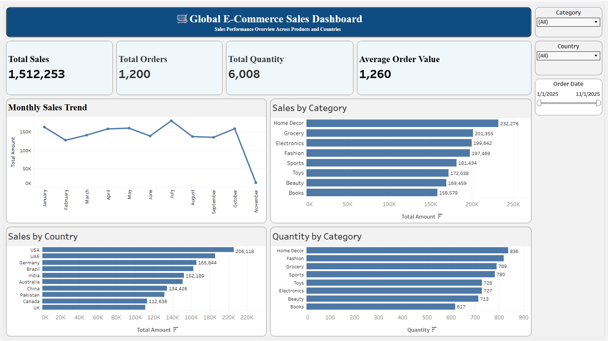

# Global E-Commerce Sales Analysis

## 📊 Project Overview

An interactive **Global E-Commerce Sales Dashboard** built using **Tableau** to analyze sales performance across products, categories, countries, and time.

The dashboard presents key business metrics and interactive visualizations to make e-commerce performance easier to understand and explore.

## 🌐 Tableau Public Dashboard

🔗 **[View Interactive Dashboard](https://public.tableau.com/views/GlobalE-CommerceSalesDashboard/GlobalE-CommerceSalesDashboard?:language=en-US&:sid=&:redirect=auth&:display_count=n&:origin=viz_share_link)**

## 🖼️ Dashboard Preview




## 🎯 Project Objective

The objective of this project is to analyze e-commerce sales data and build an interactive dashboard that helps identify:

- Overall sales performance
- Monthly sales trends
- Top-performing product categories
- Sales performance by country
- Quantity sold by category
- Average Order Value
- Performance changes using interactive filters

## 🛠️ Tools & Technologies

- **Tableau** – Data analysis and visualization
- **CSV** – Dataset
- **GitHub** – Project documentation and version control

## 📌 Dashboard KPIs

| KPI | Value |
|---|---:|
| Total Sales | 1,512,253 |
| Total Orders | 1,200 |
| Total Quantity | 6,008 |
| Average Order Value | 1,260 |

## 📈 Dashboard Visualizations

### Monthly Sales Trend
Shows how total sales change across the months in the dataset.

### Sales by Category
Compares total sales across different product categories to identify the strongest-performing categories.

### Sales by Country
Compares total sales across countries to understand geographical sales performance.

### Quantity by Category
Shows the quantity of products sold across different categories.

## 🎛️ Interactive Filters

The dashboard includes interactive filters for:

- **Category**
- **Country**
- **Order Date**

These filters allow users to focus the analysis on specific categories, countries, or time periods.

## 🔍 Key Insights

- **Home Decor** generated the highest sales among the product categories.
- The **USA** recorded the highest sales among the countries shown.
- **Home Decor** also had the highest quantity sold.
- Monthly sales varied throughout the year, with noticeable changes from month to month.
- Interactive filters allow users to perform more focused analysis.

## 📂 Dataset

The dataset contains e-commerce transaction information such as:

- Order ID
- Order Date
- Country
- Category
- Quantity
- Unit Price
- Total Amount

The dataset is used for educational and portfolio purposes.

## 📁 Project Structure

```text
Global-Ecommerce-Sales-Analysis/
│
├── README.md
├── Global_Ecommerce_Sales_Dashboard.twbx
├── dataset/
│   └── global_ecommerce_sales.csv
└── Dashboard.png
```

## 💡 Skills Demonstrated

- Data Analysis
- Data Visualization
- Tableau
- Dashboard Development
- KPI Development
- Interactive Filtering
- Business Insights
- Data Storytelling

## 👨‍💻 Author

**Ganesh Jogi**

B.Tech Electrical Engineering | Aspiring Data Analyst

---

⭐ This project demonstrates practical Tableau dashboard development and e-commerce sales analysis.
